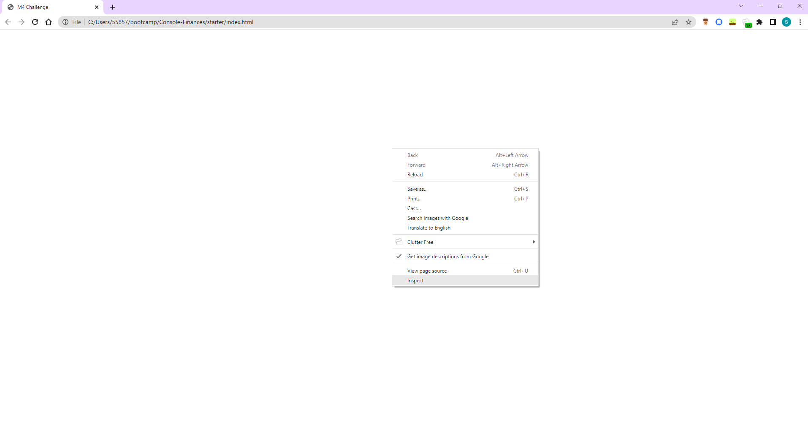
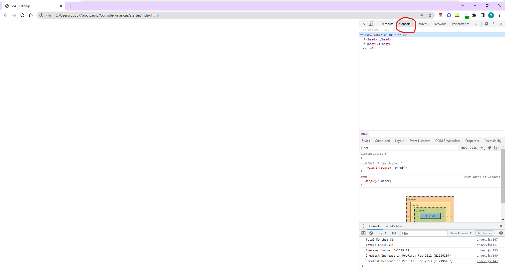
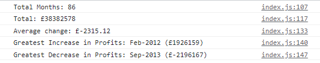

# Console-Finances
A javascript project which performs calculations based on a financial dataset and displays the results in the console

## Description

This website houses a JavaScript programme which performs calculations on a dummy financial dataset and returns these calculations in full sentences with appropriate punctuation in the console log when inspected.

The project helped me learn how to perform mathematic tasks on an array in javascript.

The project is deployed to GitHub pages, at: https://merrims.github.io/Console-Finances/

## Usage

The site displays a blank page. To access the results of the calculations, follow these steps:

1. Right click anywhere in the browser window and select "Inspect"

2. Click the "Console" tab in the window

You should see the following results in the window:

## Credits

I used StackExchange on many occasions for ideas when debugging specific issues: https://stackoverflow.com/

I based my code to convert the arrays to key-value pairs on the code in the following StackOverflow link: https://stackoverflow.com/questions/62196750/convert-array-of-arrays-to-key-value-pairs-using-plain-javascript-or-jquery

## License

MIT Licence